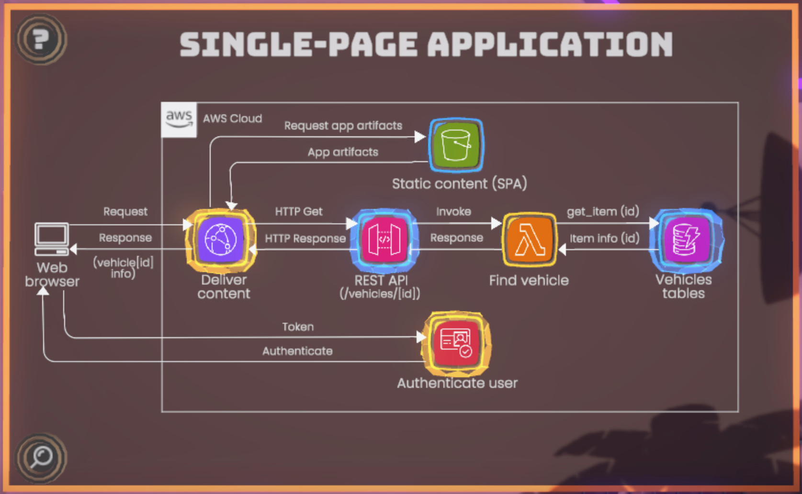

# Architecture

# Cost Estimation

The following cost estimates were created using the [AWS Pricing Calculator](https://calculator.aws/). They  only provide a rough estimate, actual costs may vary.

Region used: eu-central-1 (Frankfurt)

**Date of Estimation: 2024-12-11**

| AWS Service | Example Scenario 1: Small                                                                                                                 | Example Scenario 2: Medium | Example Scenario 3: Large |
|-------------|-------------------------------------------------------------------------------------------------------------------------------------------|----------------------------|---------------------------|
| S3          | 0,01 GB stored in 10 files 30 uploads per month, 10 requests per day = 10 x 10 x 30 = 3.000 per month = 3 GB  0.1 USD | todo                       | todo                      |
| CloudFront  | 3 GB data out, 3.000 requests  0.26 USD                                                                                    |                            |                           |
| **Total**   | **0.27 USD**                                                                                                                              | **todo**                   | **todo**                  ||
